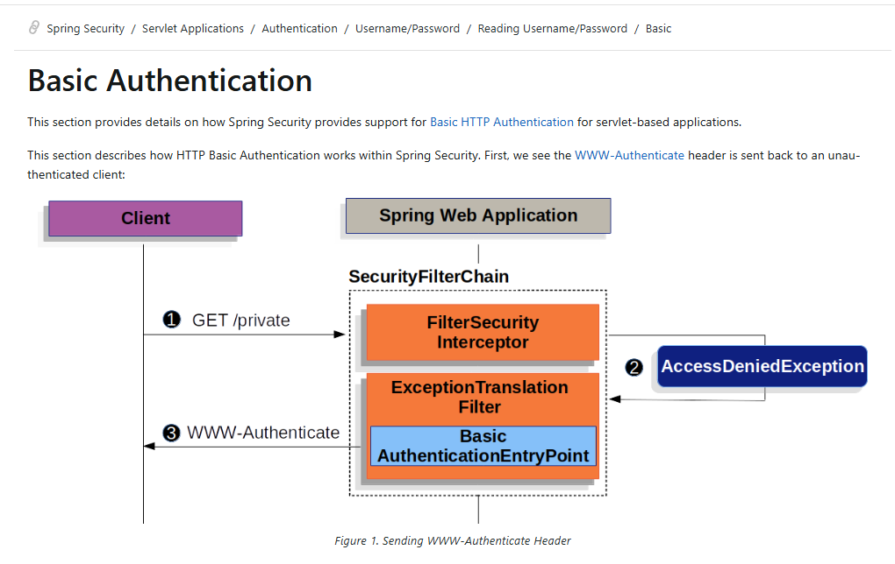
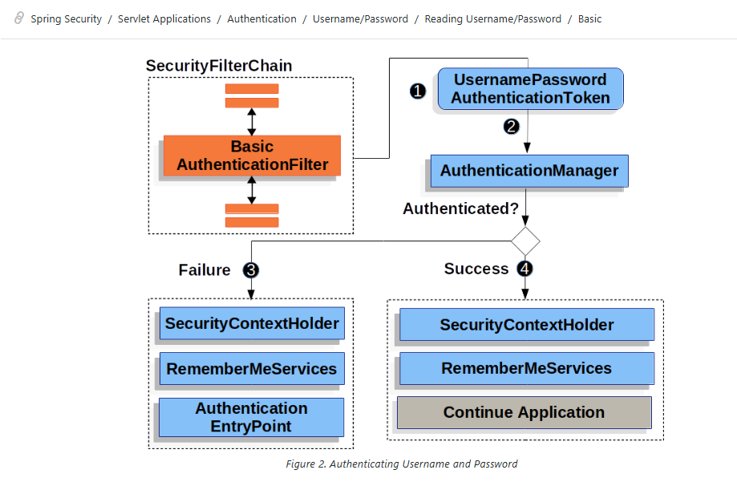

# 🔐 Spring Security – HTTP Basic Authentication

<p align="center">
  
  
  
  
</p>

> A hands-on Spring Boot project for understanding **how HTTP Basic Authentication actually works inside Spring Security**.

This project is designed as a learning project. Instead of only configuring security, we follow the complete request flow through:

- `SecurityFilterChain`
- `BasicAuthenticationFilter`
- `UsernamePasswordAuthenticationToken`
- `AuthenticationManager`
- `AuthenticationProvider`
- `DaoAuthenticationProvider`
- `UserDetailsService`
- `InMemoryUserDetailsManager`
- `SecurityContext`
- `SecurityContextHolder`
- Authorization and exception handling

---

# 📚 Table of Contents

- [1. What This Project Teaches](#1--what-this-project-teaches)
- [2. Tech Stack](#2--tech-stack)
- [3. Project Structure](#3--project-structure)
- [4. Application Security Configuration](#4--application-security-configuration)
- [5. API Endpoints](#5--api-endpoints)
- [6. In-Memory User](#6--in-memory-user)
- [7. Basic Authentication Architecture](#7--basic-authentication-architecture)
  - [7.1 Request Without Credentials](#71-request-without-credentials)
  - [7.2 Request With Username and Password](#72-request-with-username-and-password)
- [8. How Our Application Works](#8--how-our-application-works)
- [9. Important Components Explained](#9--important-components-explained)
- [10. Important Filters](#10--important-filters)
- [11. Authentication vs Authorization](#11--authentication-vs-authorization)
- [12. Testing the APIs](#12--testing-the-apis)
- [13. Troubleshooting](#13--troubleshooting)
- [14. Important Learning Notes](#14--important-learning-notes)
- [15. Final Mental Model](#15--final-mental-model)
- [16. Next Learning Steps](#16--next-learning-steps)

---

# 1. 🎯 What This Project Teaches

The purpose of this project is to understand the answer to one important question:

> **What happens internally when a client calls a Spring Boot API protected by HTTP Basic Authentication?**

This project demonstrates:

- Public endpoints using `permitAll()`
- Protected endpoints using `authenticated()`
- HTTP Basic Authentication
- In-memory users
- `UserDetails`
- `UserDetailsService`
- `InMemoryUserDetailsManager`
- Request interception by Spring Security filters
- Authentication using `AuthenticationManager`
- User loading using `DaoAuthenticationProvider`
- Storing successful authentication in the `SecurityContext`
- Returning `401 Unauthorized` when authentication fails
- Sending the `WWW-Authenticate` challenge when credentials are missing

---

# 2. 🛠 Tech Stack

| Technology | Purpose |
|---|---|
| ☕ **Java 17+** | Programming language |
| 🌱 **Spring Boot 3.x** | Application framework |
| 🛡️ **Spring Security 6.x** | Authentication and authorization |
| 🔐 **HTTP Basic** | Authentication mechanism |
| 📦 **Maven** | Build and dependency management |
| 🧪 **Postman** | API testing |
| 🐙 **Git / GitHub** | Version control |

---

# 3. 📁 Project Structure

```text
src
└── main
    ├── java
    │   └── com
    │       └── jt
    │           ├── BasicAuthenticationApplication.java
    │           │
    │           ├── config
    │           │   └── SecurityConfig.java
    │           │
    │           └── controller
    │               └── HelloController.java
    │
    └── resources
        └── application.properties

pom.xml
README.md
basic-auth-www-authenticate-flow.png
basic-auth-authentication-flow.png
```

### Responsibilities

| File | Responsibility |
|---|---|
| `BasicAuthenticationApplication.java` | Starts the Spring Boot application |
| `SecurityConfig.java` | Defines Spring Security configuration |
| `HelloController.java` | Contains REST API endpoints |
| `application.properties` | Application configuration |
| `pom.xml` | Dependencies and build configuration |

---

# 4. 🔧 Application Security Configuration

The core configuration is:

```java
@Configuration
@EnableWebSecurity
public class SecurityConfig {

    @Bean
    public SecurityFilterChain filterChain(HttpSecurity http) throws Exception {

        http
            .csrf(csrf -> csrf.disable())
            .authorizeHttpRequests(auth -> auth
                .requestMatchers("/api/public").permitAll()
                .anyRequest().authenticated()
            )
            .httpBasic(Customizer.withDefaults());

        return http.build();
    }

    @Bean
    public UserDetailsService userDetailsService() {

        UserDetails user = User
                .withUsername("jety")
                .password("{noop}jety123")
                .roles("USER")
                .build();

        return new InMemoryUserDetailsManager(user);
    }
}
```

Let's understand what each part does.

## `@Configuration`

Tells Spring:

> This class contains Spring configuration.

## `@EnableWebSecurity`

Enables Spring Security web support.

## `SecurityFilterChain`

Defines how incoming HTTP requests are secured.

Think of it as:

```text
HTTP Request
     ↓
SecurityFilterChain
     ↓
Security Filters
     ↓
Authentication
     ↓
Authorization
     ↓
Controller
```

## `.csrf(csrf -> csrf.disable())`

Disables CSRF protection for this learning REST API configuration.

## `.requestMatchers("/api/public").permitAll()`

Allows anyone to access:

```text
/api/public
```

No authentication is required.

## `.anyRequest().authenticated()`

Every request not matched by the previous rule requires authentication.

## `.httpBasic(Customizer.withDefaults())`

Enables HTTP Basic Authentication using Spring Security's default configuration.

## `return http.build()`

Builds and returns the configured `SecurityFilterChain`.

---

# 5. 🌐 API Endpoints

| Method | Endpoint | Security | Description |
|---|---|---|---|
| `GET` | `/api/public` | Public | No credentials required |
| `GET` | `/api/hello` | Protected | Valid credentials required |

The security rules are:

```text
/api/public
    ↓
permitAll()
    ↓
ACCESS ALLOWED
```

```text
/api/hello
    ↓
authenticated()
    ↓
Authentication required
```

---

# 6. 👤 In-Memory User

This project creates a user directly in application memory:

```java
@Bean
public UserDetailsService userDetailsService() {

    UserDetails user = User
            .withUsername("jety")
            .password("{noop}jety123")
            .roles("USER")
            .build();

    return new InMemoryUserDetailsManager(user);
}
```

## User details

| Property | Value |
|---|---|
| Username | `jety` |
| Password | `jety123` |
| Role | `USER` |
| Storage | In-memory |

## Understanding the code

### `User`

This is Spring Security's `User` class:

```java
org.springframework.security.core.userdetails.User
```

It provides a builder for creating `UserDetails`.

### `withUsername("jety")`

Sets the username.

### `password("{noop}jety123")`

Sets the password.

`{noop}` means:

> No password encoding is used.

This is useful for learning only.

### `roles("USER")`

Assigns the user a role.

Spring Security represents this role internally as an authority similar to:

```text
ROLE_USER
```

### `build()`

Creates the final `UserDetails` object.

### `new InMemoryUserDetailsManager(user)`

Stores the user in memory and provides `UserDetailsService` functionality for loading the user during authentication.

---

# 7. 🧭 Basic Authentication Architecture

This project focuses on two important flows:

1. **A protected request without credentials**
2. **A request with Basic Authentication credentials**

---

## 7.1 Request Without Credentials

When a client requests a protected endpoint without credentials, Spring Security cannot authenticate the user.

The following architecture shows the Basic Authentication challenge flow:



### What the architecture shows

```text
Client requests protected resource
            ↓
Request enters SecurityFilterChain
            ↓
User is not authenticated
            ↓
Access to protected resource is not allowed
            ↓
Security exception handling
            ↓
BasicAuthenticationEntryPoint
            ↓
401 Unauthorized
+ WWW-Authenticate header
```

### Step-by-step

### Step 1 — Client requests a protected endpoint

Example:

```http
GET /api/hello
```

But no credentials are sent.

There is no:

```http
Authorization: Basic ...
```

header.

### Step 2 — Request enters `SecurityFilterChain`

The request is intercepted before it reaches the controller.

Spring Security processes the request through its security filters.

### Step 3 — The request is not authenticated

The protected endpoint requires:

```java
.anyRequest().authenticated()
```

But the current request has no authenticated user.

### Step 4 — Authentication is required

Spring Security's exception handling flow triggers the configured authentication entry point.

For HTTP Basic Authentication, the important entry point is:

```text
BasicAuthenticationEntryPoint
```

### Step 5 — Spring returns a Basic Authentication challenge

The response is similar to:

```http
HTTP/1.1 401 Unauthorized
WWW-Authenticate: Basic
```

The important header is:

```text
WWW-Authenticate
```

Its purpose is to tell the client:

> This resource requires HTTP Basic Authentication credentials.

### Mental model

```text
No credentials
      ↓
Protected API
      ↓
Cannot authenticate
      ↓
401 Unauthorized
      ↓
WWW-Authenticate: Basic
```

---

## 7.2 Request With Username and Password

When the client sends Basic Authentication credentials, Spring Security begins the authentication process.

The following architecture shows the authentication flow:



### High-level flow

```text
Authorization: Basic credentials
            ↓
BasicAuthenticationFilter
            ↓
UsernamePasswordAuthenticationToken
            ↓
AuthenticationManager
            ↓
AuthenticationProvider
            ↓
UserDetailsService
            ↓
Load user
            ↓
Verify password
            ↓
      Authenticated?
       /         \
     NO           YES
     ↓             ↓
Failure      SecurityContext
     ↓             ↓
401        Continue Application
```

---

# 8. 🚀 How Our Application Works

Now let's connect the architecture directly to our application.

## Scenario A — Public endpoint

Request:

```http
GET http://localhost:8080/api/public
```

The request matches:

```java
.requestMatchers("/api/public").permitAll()
```

Result:

```text
200 OK
```

No authentication is required.

---

## Scenario B — Protected endpoint without credentials

Request:

```http
GET http://localhost:8080/api/hello
```

The request matches:

```java
.anyRequest().authenticated()
```

But the user is not authenticated.

Flow:

```text
/api/hello
     ↓
SecurityFilterChain
     ↓
No authenticated user
     ↓
Protected resource
     ↓
Authentication required
     ↓
BasicAuthenticationEntryPoint
     ↓
401 Unauthorized
     ↓
WWW-Authenticate
```

---

## Scenario C — Protected endpoint with credentials

The client sends:

```http
GET /api/hello
Authorization: Basic <encoded-credentials>
```

Conceptually, the client provides:

```text
jety:jety123
```

The complete application flow is:

### Step 1 — Request enters `SecurityFilterChain`

Every secured HTTP request first passes through the Spring Security filter chain.

```text
Client
  ↓
SecurityFilterChain
```

### Step 2 — `BasicAuthenticationFilter` reads the header

It looks for:

```http
Authorization: Basic ...
```

It extracts:

```text
Username = jety
Password = jety123
```

### Step 3 — `UsernamePasswordAuthenticationToken` is created

Spring Security creates an authentication request object.

Conceptually:

```text
UsernamePasswordAuthenticationToken
├── principal   = jety
├── credentials = jety123
└── authenticated = false
```

At this point:

> Credentials have been collected, but the user is not authenticated yet.

### Step 4 — Token goes to `AuthenticationManager`

The authentication request is delegated to:

```text
AuthenticationManager
```

Its responsibility is to coordinate authentication.

Conceptually:

```text
AuthenticationManager
        ↓
Find a suitable AuthenticationProvider
```

### Step 5 — `AuthenticationProvider` authenticates the request

For username/password authentication, the commonly used provider is:

```text
DaoAuthenticationProvider
```

It needs to answer:

```text
Does the user exist?
Does the password match?
```

### Step 6 — `UserDetailsService` loads the user

The provider asks:

```java
loadUserByUsername("jety")
```

Conceptually:

```text
DaoAuthenticationProvider
        ↓
UserDetailsService
        ↓
InMemoryUserDetailsManager
        ↓
Find user: jety
```

The user is returned as a `UserDetails` object.

### Step 7 — Password is verified

Spring Security compares:

```text
Password from request
        VS
Password stored for user
```

For this learning project:

```text
{noop}jety123
```

is used.

If the password does not match:

```text
Authentication fails
        ↓
401 Unauthorized
```

If the password matches:

```text
Authentication succeeds
```

### Step 8 — Successful authentication is created

Spring Security now creates a successful authentication result.

Conceptually:

```text
Authentication
├── Principal    = authenticated user
├── Authorities  = ROLE_USER
└── Authenticated = true
```

### Step 9 — Authentication is stored in the `SecurityContext`

The successful authentication is associated with the current security context.

```text
SecurityContextHolder
        ↓
SecurityContext
        ↓
Authentication
        ↓
Current authenticated user
```

This is how Spring Security knows who is making the current request.

### Step 10 — Authorization happens

Spring Security checks:

```java
.anyRequest().authenticated()
```

It asks:

```text
Is the current request authenticated?
```

The answer is:

```text
YES
```

Access is allowed.

### Step 11 — Request reaches the controller

The request continues to:

```text
HelloController
```

The controller processes the request.

Result:

```text
200 OK
```

---

# 9. 🧩 Important Components Explained

## `SecurityFilterChain`

A chain of security filters that intercepts HTTP requests.

```text
Request
   ↓
SecurityFilterChain
   ↓
Security Filters
   ↓
Authentication
   ↓
Authorization
   ↓
Controller
```

It is the main security pipeline of a servlet-based Spring Security application.

---

## `BasicAuthenticationFilter`

Responsible for reading Basic Authentication credentials.

It:

1. Checks for the `Authorization` header.
2. Reads Basic credentials.
3. Extracts username and password.
4. Creates an authentication request.
5. Delegates authentication.

Conceptually:

```text
Authorization: Basic ...
          ↓
BasicAuthenticationFilter
          ↓
Username + Password
          ↓
AuthenticationManager
```

---

## `UsernamePasswordAuthenticationToken`

Represents an authentication request.

Before successful authentication:

```text
UsernamePasswordAuthenticationToken
├── username
├── password
└── authenticated = false
```

After successful authentication, the resulting `Authentication` contains the authenticated principal and authorities.

---

## `AuthenticationManager`

Coordinates authentication.

It receives an authentication request and delegates it to a suitable `AuthenticationProvider`.

Think:

```text
AuthenticationManager
        ↓
"Who can authenticate this token?"
        ↓
AuthenticationProvider
```

---

## `AuthenticationProvider`

Performs authentication for a supported authentication type.

It may:

- Authenticate successfully
- Return an authenticated result
- Reject the credentials

---

## `DaoAuthenticationProvider`

A common provider for username/password authentication.

It works with:

```text
UserDetailsService
+
Password verification
```

Conceptually:

```text
UsernamePasswordAuthenticationToken
          ↓
DaoAuthenticationProvider
          ↓
Load user
          ↓
Verify password
          ↓
Success / Failure
```

---

## `UserDetailsService`

A service responsible for loading user-specific security information.

Its important method is:

```java
loadUserByUsername(String username)
```

It returns:

```text
UserDetails
```

Important:

```text
UserDetails
    = information about one user

UserDetailsService
    = service used to load that information
```

---

## `InMemoryUserDetailsManager`

The `UserDetailsService` implementation used by this project.

It stores users in memory.

```text
DaoAuthenticationProvider
        ↓
InMemoryUserDetailsManager
        ↓
UserDetails
```

Because users are stored in memory:

> Restarting the application recreates the configured in-memory users.

---

## `SecurityContext`

Stores security information associated with the current request, including authentication information.

Conceptually:

```text
SecurityContext
        ↓
Authentication
        ↓
Authenticated user
```

---

## `SecurityContextHolder`

Provides access to the current `SecurityContext`.

Simplified:

```text
SecurityContextHolder
        ↓
SecurityContext
        ↓
Authentication
```

---

## `BasicAuthenticationEntryPoint`

Handles the situation where an unauthenticated client attempts to access a protected resource in the HTTP Basic flow.

It sends a response that includes the Basic authentication challenge:

```text
401 Unauthorized
WWW-Authenticate
```

---

# 10. 🔍 Important Filters

The exact list and order of filters can vary based on Spring Security version and configuration. For understanding this project, these are the important filters and responsibilities.

| Filter | Why it matters |
|---|---|
| `SecurityContextHolderFilter` | Works with the security context for the request |
| `HeaderWriterFilter` | Adds configured security headers |
| `CsrfFilter` | Handles CSRF protection when enabled; disabled in this learning project |
| `BasicAuthenticationFilter` | Reads Basic credentials and starts authentication |
| `AnonymousAuthenticationFilter` | Represents an unauthenticated request as anonymous when appropriate |
| `ExceptionTranslationFilter` | Handles security exceptions and triggers authentication handling |
| `AuthorizationFilter` | Applies authorization decisions based on configured rules |

## Important relationship

```text
BasicAuthenticationFilter
        ↓
Authentication
        ↓
SecurityContext
        ↓
AuthorizationFilter
        ↓
Allow / Deny
```

---

# 11. 🔐 Authentication vs Authorization

These are different concepts.

## Authentication

Authentication answers:

> **Who are you?**

Example:

```text
Username + Password
        ↓
Verification
        ↓
Authenticated
```

## Authorization

Authorization answers:

> **What are you allowed to access?**

Example:

```text
Authenticated user
        ↓
Security rules
        ↓
Allow / Deny
```

In this project:

```java
.anyRequest().authenticated()
```

means:

> The user must be authenticated.

Although the user has:

```java
.roles("USER")
```

this project is not yet using role-based endpoint restrictions.

That will come later with rules such as:

```java
.hasRole("USER")
.hasRole("ADMIN")
```

---

# 12. 🧪 Testing the APIs

## 1. Test Public Endpoint

```http
GET http://localhost:8080/api/public
```

Expected:

```text
200 OK
```

No credentials required.

---

## 2. Test Protected Endpoint Without Credentials

```http
GET http://localhost:8080/api/hello
```

Expected:

```text
401 Unauthorized
```

The response follows the HTTP Basic challenge flow.

---

## 3. Test Protected Endpoint With Credentials

In Postman:

```text
Authorization
    ↓
Type: Basic Auth
    ↓
Username: jety
Password: jety123
```

Then send:

```http
GET http://localhost:8080/api/hello
```

Expected:

```text
200 OK
```

---

# 13. 🛠 Troubleshooting

## `User.withUsername()` shows an error

Check the import.

Correct:

```java
import org.springframework.security.core.userdetails.User;
```

Wrong for this configuration:

```java
import org.apache.catalina.User;
```

The class name `User` exists in multiple libraries, so IDE auto-import can select the wrong one.

---

## `401 Unauthorized`

Check:

- Username
- Password
- Authorization header
- Postman authentication type
- Protected endpoint configuration

For this project:

```text
Username: jety
Password: jety123
```

---

## Public endpoint requires authentication

Verify:

```java
.requestMatchers("/api/public").permitAll()
```

Also verify that the controller mapping exactly matches `/api/public`.

---

## Protected endpoint is accessible without authentication

Verify:

```java
.anyRequest().authenticated()
```

and make sure the endpoint is not matched by a previous `permitAll()` rule.

---

# 14. 📝 Important Learning Notes

### Base64 is not encryption

HTTP Basic Authentication encodes credentials using Base64.

```text
Base64 ≠ Encryption
```

For real applications, use HTTPS.

---

### `{noop}` is for learning

This project uses:

```java
.password("{noop}jety123")
```

A production application should use a secure password encoder, such as BCrypt.

---

### In-memory users are temporary application data

The user is configured in application memory.

No database is involved.

---

### Role exists, but RBAC is not implemented yet

The user has:

```text
USER
```

but current access is controlled by:

```text
authenticated or not authenticated
```

The project is not yet using role-based access rules such as:

```java
.hasRole("USER")
```

---

# 15. 🧠 Final Mental Model

## Request without credentials

```text
Client
  ↓
GET /api/hello
  ↓
SecurityFilterChain
  ↓
No authentication
  ↓
Protected resource
  ↓
Exception handling
  ↓
BasicAuthenticationEntryPoint
  ↓
401 Unauthorized
+ WWW-Authenticate
```

## Request with valid credentials

```text
Client
  ↓
Authorization: Basic credentials
  ↓
SecurityFilterChain
  ↓
BasicAuthenticationFilter
  ↓
UsernamePasswordAuthenticationToken
  ↓
AuthenticationManager
  ↓
DaoAuthenticationProvider
  ↓
UserDetailsService
  ↓
InMemoryUserDetailsManager
  ↓
Load UserDetails
  ↓
Verify Password
  ↓
Authentication Success
  ↓
SecurityContext
  ↓
Authorization
  ↓
Controller
  ↓
200 OK
```

If you understand these two flows, you understand the foundation of how **HTTP Basic Authentication works in Spring Security**.

---

# 16. 🚀 Next Learning Steps

Recommended progression:

```text
1. PasswordEncoder
        ↓
2. BCryptPasswordEncoder
        ↓
3. Custom UserDetails
        ↓
4. Custom UserDetailsService
        ↓
5. Database Authentication
        ↓
6. Roles and Authorities
        ↓
7. Role-Based Access Control (RBAC)
        ↓
8. JWT Authentication
        ↓
9. OAuth2 / Resource Server
```

---

## ⭐ Key Takeaway

> **`SecurityFilterChain` intercepts the request. `BasicAuthenticationFilter` extracts credentials. `AuthenticationManager` coordinates authentication. `DaoAuthenticationProvider` loads and verifies the user. A successful authentication is stored in the `SecurityContext`, and only then can the protected request continue.**

---

### Happy Learning 🚀

Built to understand **Spring Security Basic Authentication from request to response**.
